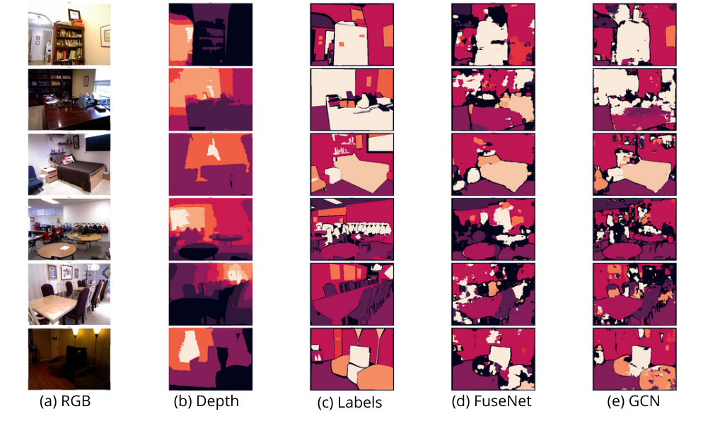

# RGBD semantic segmentation based on Global Convolutional Network in PyTorch

Implementation of the article : RGBD Semantic Segmentation Based on Global ConvolutionalNetwork, 2019 (https://www.researchgate.net/publication/335876739_RGBD_Semantic_Segmentation_Based_on_Global_Convolutional_Network).

I implemented the two dual encoders of the article in PyTorch : FuseNet and GCN.

## Getting Started

## Dataset preparation

### NYUv2 Dataset

This dataset contains 1449 RGBD images for 894 different classes.

| Original dataset distribution (truncated) | Dataset used (21 classes) |
|---| --- |
|  |  |

I only kept the 21 classes that were the most present in the dataset

| Original RGB image (480x640x3) | Subsampled RGB image used (240x320x3) |
|---| --- |
|  |  |

I subsampled the image by 2

| Original Labels (480x640x1) with 894 classes  | Subsampled labels used (240x320x1) with 21 classes  |
|---| --- |
|  |  |

## Models

The models of the articles are two dual encoder-decoder where the depth is added during the encoded phase.

### FuseNet

The encoder for the RGB images has the same architecture as the VGG16-Net.

| Prediction with FuseNet on training set | Label |
|---| --- |
|  |  |

| Prediction with FuseNet on testing set | Label |
|---| --- |
|  |  |

### GCN

It has almost the same architecture as FuseNet. It adds extra layers of global convolutional network (convolution of size kxk).
Here the convolution added is 5x5.

| Prediction with GCN on training set | Label |
|---| --- |
|  |  |

| Prediction with GCN on testing set | Label |
|---| --- |
|  |  |

### Results

Here is a summary of the final scores :

| Scores |
|---|
|  |

| Models  | FuseNet without transfer learning | FuseNet with transfer learning (VGG16-Net) | GCN with transfer learning | FuseNet of the article | GCN of the article
| Mean accuracy | 25.37 | 33.51 | 39.24 | 46.42 | 48.49 |
|Mean IoU | 16.87 | 20.27 | 23.50 | 35.48 | 36.94 |
|Pixel accuracy | 46.63 | 51.30 | 55.62 | 68.76 | 69.11 |
