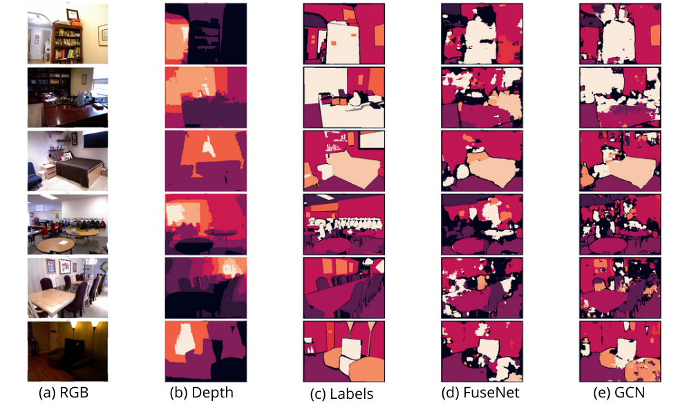

# RGBD semantic segmentation based on Global Convolutional Network in PyTorch

Implementation of the article : RGBD Semantic Segmentation Based on Global ConvolutionalNetwork, 2019 (https://www.researchgate.net/publication/335876739_RGBD_Semantic_Segmentation_Based_on_Global_Convolutional_Network).

I implemented the two dual encoders of the article in PyTorch : FuseNet and GCN.

## Getting Started

## Dataset preparation

## Models

### FuseNet

### GCN

### Results
